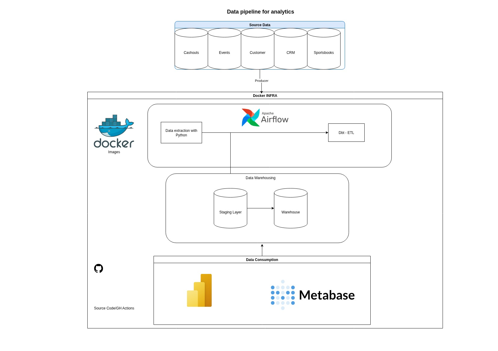
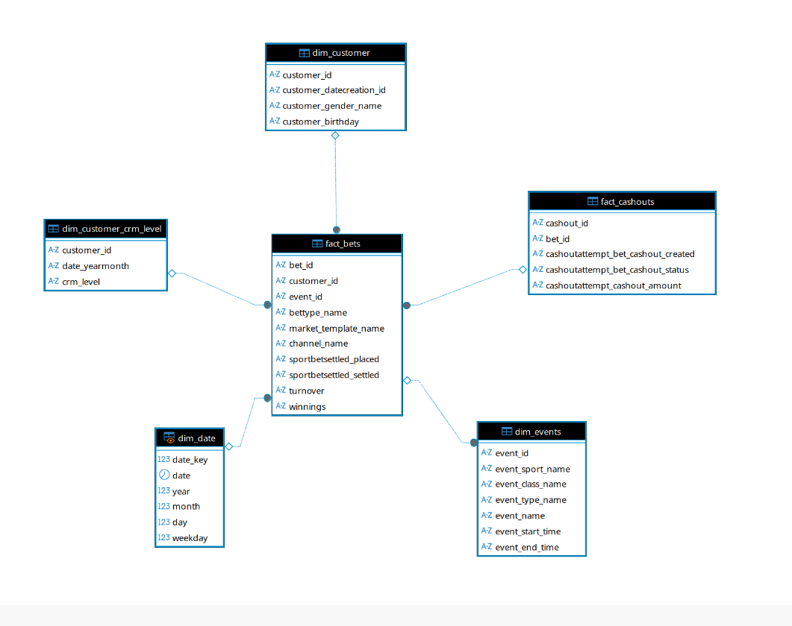

# Sportsbook Data Platform

End-to-end data platform project simulating a real-world Sportsbook analytics environment.  
The project covers ingestion, transformation, orchestration and visualization using modern open-source tools.

---

## Architecture Overview

**Flow:**

Raw CSV files  
→ Python ETL  
→ PostgreSQL (Raw Layer)  
→ dbt (Staging & Star Schema)  
→ Orchestration (Airflow)  
→ Visualization (Metabase)

**Layers:**
- **Raw**: source-aligned ingestion
- **Staging**: cleaned and standardized models
- **Mart**: star schema (facts & dimensions)

---

## Tech Stack

- **Python 3.10**
- **PostgreSQL 15**
- **Apache Airflow 2.8**
- **dbt Core 1.7 (Postgres adapter)**
- **Metabase**
- **Docker & Docker Compose**

---

## Data Modeling

The data warehouse follows a **Star Schema** design.

### Fact Tables
- `fact_bets`

### Dimension Tables
- `dim_customer`
- `dim_customer_crm_level`
- `dim_event`
- `dim_date`
- `dim_cashout`

This design enables:
- fast analytical queries
- BI-friendly consumption
- clear business semantics

---

## Orchestration (Airflow)

The pipeline is orchestrated using **Apache Airflow**.

### DAG: `sportsbook_pipeline`

**Steps:**
1. Python ETL → load CSVs into `raw` schema
2. `dbt run` → build staging & mart models
3. `dbt test` → validate transformations

The DAG is **trigger-based** (no schedule by default).

## Visualization

**Metabase** connects directly to PostgreSQL and exposes:

- Star schema tables
- Business metrics
- Dashboards (bets, revenue, customers)

Metabase runs fully containerized.

---

##  How to Run Locally

### Prerequisites
- Docker
- Docker Compose

### 1️Clone the repository

git clone https://github.com/flipg1995/sportsbook-data-platform.git
cd sportsbook-data-platform

### Start the platform

docker compose up --build

Airflow	http://localhost:8080
Metabase http://localhost:3000
PostgreSQL http://localhost:5432
Dbt Docs http://localhost:8081

### Run the Pipeline

Open Airflow UI

Enable DAG sportsbook_pipeline

Trigger the DAG manually

If all tasks succeed, the data warehouse is ready.

### Database Connection (Metabase)

Host: postgres

Database: sportsbook_dw

User: dw_user

Password: dw_pass

Port: 5432